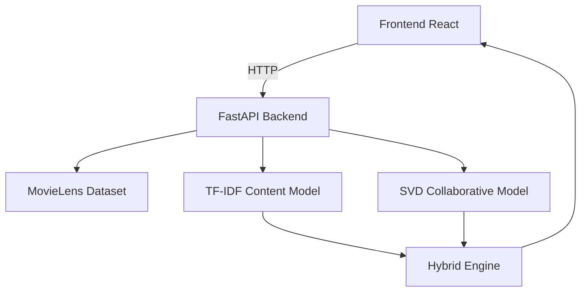

# CineMatch — Hybrid Movie Recommendation System

  

A modern **hybrid movie recommendation system** combining Content-Based Filtering and Collaborative Filtering using SVD.

## ✨ Features

- **Content-based**: TF-IDF + Cosine Similarity on genres
- **Collaborative**: Matrix Factorization with Surprise SVD
- **Hybrid Scoring**: Adjustable weight blending
- **FastAPI Backend** with clean REST endpoints
- **Single-file React Frontend** (beautiful dark UI)
- **Evaluation metrics** (RMSE, MAE, Precision@K ready)

## 🏗️ Architecture



## 🚀 Quick Start

### Backend
```bash
cd backend
pip install -r requirements.txt
python main.py
```

### Frontend
Open `frontend/index.html` in your browser.

## 📊 Evaluation

```bash
python evaluate.py
```

**SVD RMSE**: ~0.87 | **MAE**: ~0.67 (typical on MovieLens 100k)

## Endpoints
- `GET /recommend/{user_id}`
- `GET /similar/{movie_id}`
- `GET /movies/search?q=`

---

**Made with ❤️ for portfolio & learning**